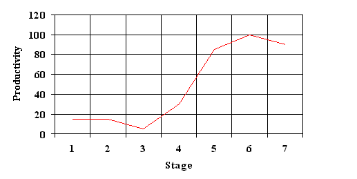

## Success through failure, where to invest a teams precious attention
### 16 years of successfully failing
#### A retrospective, introspective

---
#### Who started out, or still writes code?

---
#### How long has it been since that code hit production and users?

---?image=images/who-dis.jpg&size=80% auto

---

## Shea Strickland
- 5 years as a Software architect
- 8 years as a Lead Consultant at Readify
- 3 years as CTO at Oztix

_... plus the blissfully ignorant junior years_

---
## Our Journey:
@ul
- The Past
- The Status Quo
- The People
- Focus
@ulend

Note:
To understand where to invest, we must first go on journey...

---
## The past
People love to compare software construction to physical construction, so let's start there...

---
@transition[fade]
Physical architecure is old... **really** old

@size[0.3em](https://thumbnails-visually.netdna-ssl.com/the-evolution-of-architectural-visualization_502919c1de958_w1500.jpg)

Note: 
- Many failures
 - Process
 - Design
 - Materials

---
### Software however, is **really** new
---
## You are here

Note:
- It's about 70 years old
- Barely 1 human generation
---
## In short, we're still learning...
Nobody really knows how this stuff works yet.

---
### The Status Quo

---
@quote[Programming languages have a devious influence: they shape our thinking habits.](Dijkstra)

Note:
Given how young we are as an industry
- Why are we so abolute in our thinking
- Dogma

---

https://www.info.ucl.ac.be/~pvr/paradigmsDIAGRAMeng101.pdf

Note:
- Trying to figure out how to construct systems
- Most paradigms 
 - from original generation
- Most of us have only ever trialed 1 or 2 paradigms
 - Not languages / syntaxes

**Poll on paradigms / syntaxes**

---
### 70 years
> @size[0.7em](In most ways, that architecture has changed very little in the seventy years since. Throughout their history, digital computers have been, roughly speaking, gigantic balls of state that are transformed, over time, by a sequence of well-defined operations. Time and order are intrinsic parts of the definition of the machine.)

@size[0.3em](http://www.informit.com/articles/article.aspx?p=2697993)

Note:
- System paradigm
 - original for von Neumann
   - virtual machine of 1 cpu and block of memory 
 - now distributed
   - highly concurrent
   - multiple cpu
   - networked systems

---
### Just because you've always done it that way...

Note:
- Given
 - we're young
 - it's not all solved yet

---?image=images/same-old.jpg&size=80% auto
@title[Same ol]

Note:
How can we address that?

---
## The People

---?image=images/patrick.jpg&size=80% auto
@title[Seen some things]

Note:
Consulting offers some unique opportunities
- Many teams
- Many industries
- Many approaches

---
@snap[west]

@snapend

#### A **large** percentage of profesionals exhibit most aspects of `Imposter syndrome`
- Perfectionism
- Overworking
- Undermining your achievements
- Fear of failure
- Discounting praise

Note:
- Because most of us don't know what we're doing
- Haven't met many who aren't

---
### `People` are all on a learning journey
@quote[Much of the excitement we get out of our work is that we don't really know what we are doing.](Dijkstra)

Note:
A big reason I think is because

---
#### Why do we experience this...
> The more knowledgeable and experienced you are on a topic, the more you learn how much you have yet to learn, so your confidence in your knowledge actually falls after it initially rises.

Note:
No one wakes up with the desire to do a bad job, what can we do?

---
### The Seven Stages of Expertise in Software Engineering (1998)
Journey from total ignorance to world-class knowledge

@size[0.3em](http://www.wayland-informatics.com/The%20Seven%20Stages%20of%20Expertise%20in%20Software.htm)

Note:
- Talks about the challenges in technical uptake.
- Why people revert to old ways / habbits.
- Saw this time and time again whilst consulting

---
### Failure factors
#### Corporate management habits
@ul
- unrealistic management expectations
- a lack of commitment to quality
- an obsession with coding 
- pernicious deadlines
- and a misallocation of skills to tasks
@ulend

Note:
Some other factors, we aren't delving into here. But well worth their own sessions.

---
### Failure factors
@ul
 - engineers’ resistance to change
 - engineers’ reluctance to participate in team approaches
@ulend

---
### Main factor
- How people absorb and apply new techniques.

Note:
- How the obtain expertise through stages of learning
- Lets look at the seven stages they identified

---?image=images/7-stages.jpg&size=80% auto

---?image=images/7-stages.jpg&size=80% auto&opacity=20
### Stage 1 : Innocent 
> @size[0.7em](may not have heard, may be vaguely aware of a techniques existence but may not see their possible relevance to their situation. May be only dimly aware that there are any software-development problems in their shop. "Frog in the Pan")

Note:
This was most common whilst consulting

---?image=images/7-stages.jpg&size=80% auto&opacity=20
### Stage 2 : Exposed
> @size[0.7em](noticed that the water is getting decidedly warm, if not downright hot. Seeking techniques that will get them out of the pan or at least reduce the heat.)
> 
> @size[0.7em](Interest level is high but their knowledge level is low, being limited to a few terms and definitions and not based on any practical experience.)

Note:
Fairly common also

---?image=images/7-stages.jpg&size=80% auto&opacity=20
### Stage 3 : Apprentice

> @size[0.7em](workshops where they tackled **small** but realistic case studies. However, the case studies apparent realism conveyed to the Stage-3 a confidence that is often unwarranted.)
> 
> @size[0.7em](minimally equipped to tackle a true, full-sized project. however, a Stage-3 has difficulty scaling the techniques up from a case study to a real project. Stage-3s know **just enough to be dangerous!**)

Note:
**Pay particular attention to this Stage**

---?image=images/7-stages.jpg&size=80% auto&opacity=20
### Stage 4 : Practitioner
> @size[0.7em](the most difficult transition of the six transitions between stages. asked to take untried, by them, techniques and apply them to a corporate project with the usual demonic cocktail of politics, deadlines and changing requirements. many people throw up their hands at this point and revert to their old mediocre but familiar ways.)

Note:
**Pay particular attention to this Stage**

---?image=images/7-stages.jpg&size=80% auto&opacity=20
#### Stage 5 : Journeyman
> @size[0.5em](have made it, often the source of advice)

#### Stage 6 : Master
> @size[0.5em](instructor. beyond the "whats" and "hows", knows the "whys".)

#### Stage 7 : Researcher
> @size[0.5em](delivering the latest developments to a wider audience, via books, articles and conference appearances. Looks for flaws and improvements, and to the future)

Note:
Important roles, but the focus is on Stages 3 and 4

---
### Stages of productivity in a technique

Remembering that each team member will be on this curve for **many** techniques at any given time

Note:
- Many parallel instances
- Notice the dip into `Stage 3`

---
### Team skill stocktake
1. Self-asses current, and where they want to be
1. Avoid critical projects where only `<=` Stage-3's. beg, borrow, steal, buy, kidnap a `>=` Stage4
1. Build an inhouse Stage6 for fundamental techniques

Note:
Sometimes, you just need to start with `Stage 3`, take an evidence based critical approach

---
### Pilots and Experiments
- Make a safe place for pilots, experiments
- Be comfortable in the knowledge that any decision you make is wrong, given time
- Embrace refactoring, both code, architectures and thought patterns

But on what?!?

---
## Focus

---

### No Silver Bullet (1986)
#### by Fred Brooks
Posit's
- Nothing's coming for a software Moore's Law
- It's a conceptual problem
> the challenge is deciding what one wants to say, not saying it

@size[0.3em](http://www.cs.nott.ac.uk/~pszcah/G51ISS/Documents/NoSilverBullet.html)
@size[0.3em](https://en.wikipedia.org/wiki/No_Silver_Bullet)

---
~~`Accidental`~~ `Incindental` | vs | `Essential`
-|-|-
not related to conceptual structure, based on development process |  | complexity related to the conceptual structure

Note:
**Incidental**
- Chasing tails
- Extreme dogmatism
- oooh Shiny!
- Complexity, cost
- Promises
    - Tradeoffs

---
@quote[The hardest single part of building a software system is deciding precisely what to build.](Fred Brooks)

---
### Putting it all together

---?image=images/all-together.png&size=contain

Note:
- Investment in wrong Incidental place
- Beware Survivorship bias
- Scatter gather tests
- Simplicity

---

Note:
- Brown bags
- Growth mindset not fixed
- Help your peers, pull them up don't push them down
- Evidence is the only real practice for imposter syndome, gather often

---
### Takeaways

- #### We are young, it's not all figured out yet
  - Growth, not fixed mindset. Everyone's learning.
- ####  Focus **more** on the Essential
  - Develop expertise in finding the essential
- #### Focus **less** on the Incidental
  - it's important, make educated, experiment based decisions
  - Pragmatic, not dogmatic. It will be the wrong decision, given time

---
### Thanks for sticking around!
#### I think we can all do better.

---

Note:
C# since 2002
Attending FP group, same problems?

---

---?image=images/rainbow.gif&position=right top&size=15% 25%
#### Reading
<ul style="font-size:0.6em">
  <li>
    The Seven Stages of Expertise in Software Engineering - 1998   
    http://www.wayland-informatics.com/The%20Seven%20Stages%20of%20Expertise%20in%20Software.htm
  </li>
  <li>
    No Silver Bullet - 1986   
    http://www.cs.nott.ac.uk/~pszcah/G51ISS/Documents/NoSilverBullet.html
  </li>
  <li>
    Biting the Silver Bullet: Toward Brighter Future for System Development - 1992   
    http://citeseerx.ist.psu.edu/viewdoc/summary?doi=10.1.1.20.5628
  </li>
  <li>
    No Silver Billet Refired - A Retrospective - 2007   
    https://www.researchgate.net/publication/221322165_No_silver_bullet_a_retrospective_on_the_essence_and_accidents_of_software_engineering
  </li>
  <li>
    No Silver Bullet: Software Engineering Reloaded - 2008   
    http://manclswx.com/papers/no_silver_bullet_reloaded.pdf
  </li>
</ul>

---?image=images/rainbow.gif&position=right top&size=15% 25%
#### Watching
<ul style="font-size:0.6em">
  <li>
    Alan Kay - The computer revolution hasnt happened yet - 1997  
    https://www.youtube.com/watch?v=oKg1hTOQXoY
  </li>
  <li>
    Bret Victor - The Future of Programming  
    https://www.youtube.com/watch?v=8pTEmbeENF4
  </li>
  <li>
    Sifting Technologies - Separating the Wheat From the Chaff - Nathaniel Schutta  
	https://vimeo.com/album/5474847/video/294583864
  </li>
  <li>The first 20 hours -- how to learn anything | Josh Kaufman  
	https://www.youtube.com/watch?v=5MgBikgcWnY
  </li>
  <li>
  	Tour of Language Landscape - Yan Cui  
  	https://vimeo.com/173256765
  </li>
  <li>
	Code, Crime, Complexity: Analyzing software with forensic psychology | Adam Tornhill  
	https://www.youtube.com/watch?v=qJ_hplxTYJw
  </li>  
</ul>
